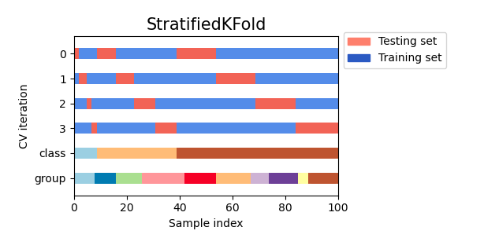

# Reference
+ [Here](https://scikit-learn.org/stable/user_guide.html)
+ [Cross-validation](https://scikit-learn.org/stable/modules/cross_validation.html#cross-validation)

# Cross-validation
+ In scikit-learn a random split into training and test sets can be quickly 
computed with the `train_test_split` helper function.
```python
from sklearn.model_selection import train_test_split
X_train, X_test, y_train, y_test = train_test_split(X, y, test_size=0.4, random_state=0)
```
## Why have "validation set":
+ When **evaluating different settings (“hyperparameters”) for estimators**,
such as the C setting that must be manually set for an SVM, there is still a risk of overfitting on the test set 
because the parameters can be **tweaked** until the estimator performs optimally.

## Why have "cross-validation":
+ However, by partitioning the available data into **three sets**, we drastically reduce the number of samples.
+ A test set should still be held out for final evaluation, but the **validation** set is **no longer needed** when doing CV.

+ K-fold CV - Procedure


## Computing cross-validated metrics
## Cross-validation iterators with stratification based on class labels
+ [Ref](https://scikit-learn.org/stable/modules/cross_validation.html#cross-validation-iterators-with-stratification-based-on-class-labels)
+ StratifiedKFold is a variation of k-fold which returns stratified folds. 
+ Each set contains approximately the **same percentage of samples of each target class** as the complete set

+ Stratified shuffle split.