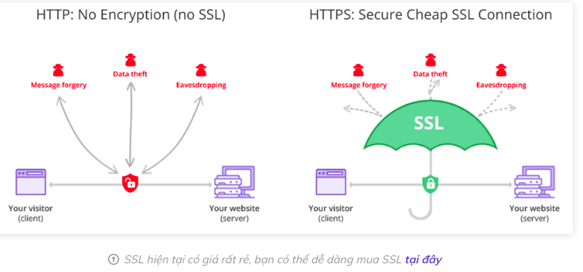

# Overview
+ [minio-overview](https://docs.min.io/minio/baremetal/introduction/minio-overview.html)
+ MinIO is API compatible with Amazon’s S3 cloud storage service
+ Use MinIO to build high performance infrastructure for machine learning, analytics and application data workloads.
# Concept
+ **Endpoint**: URL to S3 service.(url to connect minio)
+ **Access Key**: Access key (aka user ID) of an account in the S3 service.
+ **Secret Key**: Secret key (aka password) of an account in the S3 service.
+ **Object** : An object is binary data, sometimes referred to as a Binary Large OBject (BLOB). Blobs can be images, audio files, spreadsheets, or even binary executable code
+ **Buckets**: A bucket is similar to a folder or directory in a filesystem, where each bucket can hold an arbitrary number of objects

# Install
+ [deploy-minio-on-docker-compose](https://docs.min.io/docs/deploy-minio-on-docker-compose)
+ [docker-compose.yaml](https://raw.githubusercontent.com/minio/minio/master/docs/orchestration/docker-compose/docker-compose.yaml)
+ ```sudo docker-compose up -d```

# Use with python
+ [python-client-api-reference](https://docs.min.io/docs/python-client-api-reference)
+ [python-example](https://github.com/minio/minio-py/tree/release/examples)
+ pip install minio
+ Upload image
+ Download image


# Http(insecure) vs https(secure) , SSL/TLS

+ [SSL](https://www.hostinger.vn/huong-dan/https-tls-ssl-la-gi)
+ [ref](https://www.digicert.com/blog/not-secure-warning-what-to-do#:~:text=The%20reason%20you%20are%20seeing,)%20or%20HTTPS%20(secure).)
+ SSL là Secure Sockets Layer (TLS thì viết tắt của Transport Layer Security), nó cho phép khách truy cập có thể truyền tải thông tin lên web server một cảnh bảo mật.
+ Khi bạn thiết lập chứng chỉ SSL, bạn sẽ cần cấu hình nó truyền dữ liệu qua HTTPS. 2 công nghệ này đi đôi với nhau mà bạn không thể chỉ dùng 1 trong 2

## Set up ssl in UBUNTU

### Nginx (engine-ex)
+ [nginx](https://www.hostinger.vn/huong-dan/nginx-la-gi-no-hoat-dong-nhu-the-nao)
+ Nginx được sử dụng để có thể xử lý hàng ngàn kết nối cùng lúc.
+ Apache(1990) là một trong những đối thủ chính của NGINX(2004)
+ NGINX là một web server mạnh mẽ mã nguồn mở. Nginx sử dụng kiến trúc đơn luồng, hướng sự kiện vì thế nó hiệu quả hơn Apache server
+ Tính năng:
  + Có khả năng xử lý hơn 10.000 kết nối cùng lúc với bộ nhớ thấp.
  + Hỗ trợ mã hoá SSL và TLS
  + Tăng tốc reverse proxy bằng bộ nhớ đệm (cache), cân bằng tải đơn giản và khả năng chịu lỗi.
  + ...
### Nginx architecture
  
+ [Nginx là gì ? Demo load balancing với nginx](https://www.lhsang.dev/posts/technique/nginx/)
### Cài đặt Nginx on ubuntu
+ [nginx-la-gi](https://topdev.vn/blog/nginx-la-gi/)