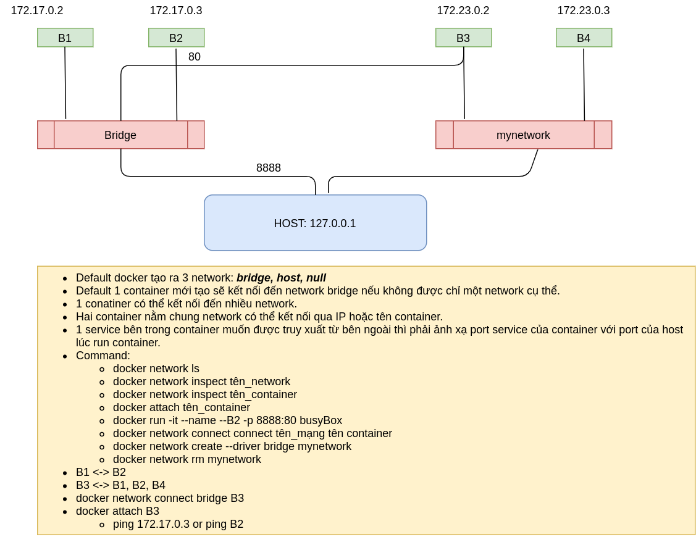

# DOCKER
## Setup without sudo
+ `sudo groupadd docker`
+ `sudo usermod -aG docker $USER`
+ `sudo su $USER`
  ## Concept
+ **Image**
  + Đóng gói một service, phần mềm, hệ điều hành, ...
  + Command: `docker image + lệnh con. docker image --help`
    + Xóa một images: docker image rm tên_image(id_image)

+ **Container**
  + Một image đang chạy.
  + Tạo và chạy container từ image: `docker run  thamso IMAGE command thamsolenh`
    + VD: `docker run -it --name tên_container ubuntu:latest(id_image)`
  + Container đang dừng muốn chạy lại: `docker start tên_container(id_container`
  + Vào terminal của container đang chạy: `docker attach tên_container(id_container)`
  + Muốn stop container từ bên ngoài: `docker stop tên_container(id_container)`
  + Xoá container: `docker rm tên_container(id_container)`
  + Xóa container đang chạy: `docker rm -f tên_container(id_container)`
  + Đang đứng ở ngoài container muốn chạy một lệnh nào đó trong container: `docker exec container command VD: docker exec ubuntu ls.`
+ **Image <-> Container**
  + Lưu container thành một image (COMMIT): `docker commit tencontainer tên_image: version.`
  + Lưu images thành file trên máy host: `docker save --output tenfile.tar tenimage(id_image)`
  + Phục hồi file đã save thành lại images: `docker load -i tenfile.tar`

+ **Transform data host vs container**
  + `docker run -it -v /home/dev6/Deskhtop/dulieu(may host):/home/dulieu(path container) --name tên_container ten_image(id_image)`
    + Khi container thao tác trên thư mục home/dulieu thì ngay cả khi container bị xóa nó vẫn còn tồn tại dữ liệu trên máy host
    + Khi thêm data vào máy host thì trên container cũng được có.
+ **Chia sẻ dữ liệu giữa các container**
  + `docker run -it --name tên_container_2 --volumes-from tên_container_muốn_chia_se_du_lieu ten_image_2(id_image_2)`

+ **Networking**
  + [xuanthulab](https://www.youtube.com/watch?v=k1SwXOxvMdE&t=6s)
  +  
  + Networking dùng để kết nối các container lại với nhau cũng như kết nối mạng ra bên ngoài.
    + **mặc định docker sẽ tạo ra 3 network: bridge, host, null**
    + **Một container mới tạo ra nếu không chỉ định network cụ thể sẽ kết nối đến mạng bridge**
    + 
  + Command: 
    + Kiểm tra các mạng có trong docker: `docker network ls`
    + Các container tự kết nối với mạng tên bridge nếu ta không chỉ định chính xác container đó kết nối vào mạng nào.
    + Kiểm tra mạng tên A có các container nào kết nối vào: `docker inspect ten_mang(bridge)`
    + Kiểm tra container đang kết nối vào mạng nào: `docker inspect ten_container(id_container)`
    + Kiểm tra hai container có kết nối vs nhau chưa: Vào 1 conatainer: `ping IP_container kia`.
  + Services in  docker-compose không thể kết nối vs một network được docker tạo từ bên ngoài.(mynetwork)
  + Network được tạo trong docker compose sẽ tự động rm khi docker-compose down.

## Command line:
+ [docker-commandline](https://docs.docker.com/engine/reference/commandline/run/)

+ 
# DOCKER FILE
## Concept
+ [docker-file-guide](https://docs.docker.com/engine/reference/builder/)
+ 
+ Docker can build images automatically by reading the instructions from a Dockerfile.
+ A Dockerfile is a text document that contains all the commands a user could call on the command line to assemble an image.
+ Using `docker build` users can create an automated build that executes several command-line instructions in succession.
+ Format: `INSTRUCTION arguments`
+ A Dockerfile must begin with a `FROM` instruction
+ ARG vs ENV : [arg vs env](https://viblo.asia/p/docker-arg-env-va-env-XL6lA4zmZek)
# Dockerfile ubuntu + miniconda + 
+ [Ref](https://gist.github.com/pangyuteng/f5b00fe63ac31a27be00c56996197597)
+ Example: 
  ```dockerfile
  FROM ubuntu:18.04
  # System packages
  RUN apt-get update && apt-get install -y wget htop python3-dev libgl1-mesa-dev libglib2.0-0 nano iputils-ping
  
  # Install miniconda to /miniconda
  RUN wget https://repo.anaconda.com/miniconda/Miniconda3-latest-Linux-x86_64.sh \
      && mkdir root/.conda \
      && bash Miniconda3-latest-Linux-x86_64.sh -b \
      && rm -f Miniconda3-latest-Linux-x86_64.sh
  
  ENV PATH="/root/miniconda3/bin:${PATH}"
  RUN conda create -y -n clover python=3.8
  RUN mkdir "clover_app"
  COPY .. clover_app/
  WORKDIR clover_app
  RUN bin/bash -c "source activate clover && pip install -r requirements.txt && python server.py"
  
  #  sudo docker build -f Dockerfile -t clover:1.0 . \
  #  sudo docker run --net=host --restart=always --name clover_v1.0 -it clover:1.0
  ```

## Build image
+ Build with all layer tag: `docker build -t clover:1.0 .`
+ Build with point to a Dockerfile: `docker build -f /path/to/a/Dockerfile .`
+ Build with layer new: `sudo docker build -f Dockerfile -t clover:1.0 .` 
+ Run container: `docker run --name test -it debian`
+ Run container with command: `sudo docker run --name clover_v1.0 -it clover:1.0 bin/bash -c "source activate clover && cd clover_app && pip install -r requirements.txt && python server.py`
+ 
+ Error:
  + /bin/sh: 1: source: not found
    + RUN source activate clover -> RUN bin/bash -c "source activate clover"
  + conda not found -> add ENV PATH 
# DOCKER COMPOSE
## File YAML:
  + [xuanthulab](https://xuanthulab.net/tim-hieu-file-yaml-co-ban.html)
  + YAML (Ain’t Markup Language) được sử dụng để biểu diễn dữ liệu dưới dạng text (giống XML, JSON ...), file YAML lưu với phần mở rộng .yml hoặc .yaml nó dễ có vẻ dễ dọc so với con người hơn (so với XML, JSON)
  + File .yml được sử dụng làm file cấu hình của nhiều ứng dụng như PHP, Docker ...
  + File yml format với cặp `key:giá-trị`
  + YAML sử dụng cú pháp viết với khảng trắng (space), phần tử dữ liệu con viết thụt vào 2 khoảng trắng so với dữ liệu cha

## Example
  + [xuanthulab](https://www.youtube.com/watch?v=6s9VqKyG1Ig&list=PLwJr0JSP7i8At14UIC-JR4r73G4hQ1CXO&index=12)
  + [docker-compose](https://xuanthulab.net/lenh-docker-compose-tao-va-chay-cac-dich-vu-docker.html)
