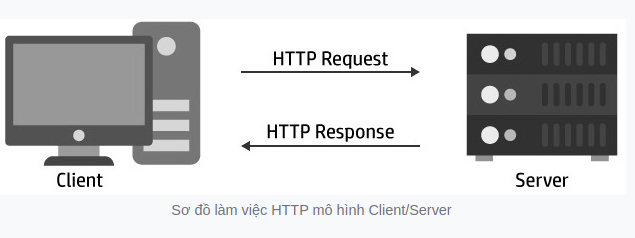

# Khái niệm
+ Stream là một kỹ thuật chuyển dữ liệu theo dòng ổn định và liên tục
+ Streaming video sử dụng cách thức phát lại các đoạn video được lưu trữ trên các máy tính trên mạng tới người dùng đầu cuối muốn xem đoạn video mà không cần tải đoạn video đó về trên máy tính.
+ Streaming hay streaming media là một quá trình mà các định dạng truyền thông (như âm thanh, hình ảnh) được gửi tới người dùng và hiển thị ngay cả khi nó vẫn đang trong quá trình tải


# Giao thức http và cấu trúc cơ bản của HTTP message
+ HTTP (Hyper Text Transfer Protocol) là giao thức truyền tải siêu văn bản. Giao thức HTTP
dựa trên giao thức TCP/IP nó cho phép lấy về tài nguyên như văn bản html, text, video, hình ảnh, ...
+ HTTP là nền tảng để trao đổi dữ liệu cho các ứng dụng web với mô hình Client/Server.
    + Client: các yêu cầu (request hay http request) được tạo bởi Client(thường là các web browser như chrome, firefox,...).
    + Server: sẽ gửi lại dữ liệu (response hay http response) để client nhận được.
+ Các request , response là các message có cấu trúc đơn giản gọi chung nó là HTTP message.


+ HTTP là phi trạng thái (stateless)

# TCP/UDP, RTSP, RTMP, HTTP, HLS, DASH
## TCP/UDP
+ Giao thức UDP (User Datagram Protocol): có đặc điểm nhanh và hiệu quả với các tập tin nhỏ nhưng truyền tải các tập tin không được sắp xếp và dễ bị mất tập tin nếu đứt đường truyền.
+ Nói qua về TCP, giao thức này đảm bảo trong quá trình truyền dữ liệu sẽ không bị mất dữ liệu và được sắp xếp đúng thứ tự.
+ Dữ liệu bị mất sẽ được truyền lại, tất nhiên không nhanh bằng UDP nhưng được cái dữ liệu được đảm bảo.

## RTSP
+ Giao thức RTSP (Real-time Streaming Protocol): ra đời vào năm 1996, được thiết kế đặc biệt cho việc stream media.
+ RTSP có hình thức khá giống giao thức HTTP, định nghĩa các tín hiệu điều khiển tuần tự, phục vụ cho việc điều khiển playback.
+ Khác với HTTP là giao thức không trạng thái, RTSP là giao thức có trạng thái.
+ RTSP sử dụng TCP để duy trì kết nối đầu cuối giống HTTP, port mặc định là 554.
+ Các IP Camera đa phần có giao thức RTSP và không hỗ trợ trực tiếp trên trình duyệt

## RTMP
+ Giao thức RTMP (Real-time Messaging Protocol): ra đời vào năm 2008, ban đầu là giao thức hỗ trợ Flash (cuối năm 2020 toang rồi), là một giao thức dựa trên TCP, liên tục duy trì kết nối, cho phép giao tiếp với độ trễ thấp.
+ Giao thức này chia luồng truyền thành nhiều đoạn (fragment), kích thước các đoạn quyết định bởi xác nhận chung của Client và Server.
+ Các đoạn này sau đó được sắp xếp lại và ghép thành một kết nối duy nhất
+ RTMP là giao thức base trên TCP, có độ trễ thấp nhưng lại được hỗ trợ không rộng rãi, muốn phát video trên web chúng ta phải cài đặt Flash.

## HTTP
### HLS
+ Giao thức HLS (HTTP Live Streaming): ra đời vào năm 2009, dựa trên giao thức HTTP ở tầng ứng dụng của Internet, hoạt động bằng cách băm luồng thành nhiều tập tin nhỏ (HTTP-based transport stream) - .ts files.
+ Các tập tin này được sắp xếp lại thứ tự bởi UTF-8 M3U playlist (.m3u8).
+ Được phát triển bởi Apple, ban đầu chỉ có iPhone là hỗ trợ giao thức này, nhưng ngày nay các thiết bị và phần mềm đều hỗ trợ nó và nó trở thành giao thức phổ biến nhất..
+ HLS là http-based, nó sử dụng web server để truyền tải nội dung.
+ Điều này có nghĩa là bạn không cần phải có hạ tầng đặc biệt chỉ cần có web server hoặc sử dụng CDN là được.

### DASH 
+ Giao thức MPEG-DASH (Dynamic Adaptive Streaming over HTTP): ra đời vào năm 2010, giao thức có phương thức hoạt động khá giống HLS, chia nội dung thành các chuỗi tập tin nhỏ.
+ MPEG-DASH là đối thủ cạnh tranh với HLS.
+ Đặc điểm đầu tiên kể đến đó là MPEG-DASH cũng là phương thức adaptive bitrate video giống với HLS

### WebRTC
+ Ngày nay để ứng dụng tối đa các lợi ích mà các giao thức livestream đem lại người ta sẽ sử dụng RTMP cho việc nhận video để thu về các video nguồn một cách nhanh nhất và sử dụng HLS để phục vụ đa dạng người dùng cuối nhanh nhất (kết hợp HLS với CDN).
# Thư viện ffmpeg.
+ Một dự án phần mềm mã nguồn mở, là một thư viện lớn, chứa nhiều chương trình xử lý video, âm thanh như ghi lại, chuyển đổi, phát trực tiếp


# Note 
### MP3, H.264, FLV
  + Âm thanh stream được nén bằng cách sử dụng định dạng âm thanh như MP3, Vorbis, AAC.
  + Hình ảnh video stream được nén bằng cách sử dụng codec video như H.264, H.265, VP8.
  + Mã hóa âm thanh và video stream được nhúng trong một gói bitstream như FLV, WebM, ASF, ISMA, MP4.
  + Một streaming server truyền Bitstream tới một streaming client bằng cách sử dụng một giao thức truyền tải, ví dụ như là MMS hoặc RTP.
  + Các streaming client có thể tương tác với streaming server bằng cách sử dụng một giao thức kiểm soát, chẳng hạn như MMS hoặc RTSP.
### RTSP, RTP, RTCP
+ Giao thức Real-time Streaming Protocol (RTSP), Real-time Transport Protocol (RTP) và Real-time Transport Control Protocol (RTCP) được thiết kế đặc biệt để stream media qua mạng
+ RTP (Real-time Transport Protocol) định dạng một gói tin RTP được dùng để truyền trên luồng dữ liệu video hay audio dựa trên địa chỉ IP.
+ RTP được sử dụng kết hợp với giao thức RTCP ( RTP Control Protocol ). Trong đó, RTP được sử dụng để đóng gói các frame dữ liệu ( audio và video) để truyền trên luồng dữ liệu thì RTCP được sử dụng để giám sát chất lượng của dịch vụ (QoS) hoặc để thống kê theo các tiêu chí trong quá trình truyền tải.
### Other
+ Đến giữa năm 2019 thì Apple cũng cho ra mắt Low-Latency HLS thế nên tính đến thời điểm hiện tại HLS vẫn đang là giao thức streaming phổ biến nhất.
+ Ngày nay các trình duyệt không cần phải cài Flash player nữa, html5 đã hỗ trợ việc play video trực tiếp rồi.


# Set up Stream server.
## Using srs
```commandline
"""
docker pull ossrs/srs:4
sudo docker run --rm -it -p 55555:1935 -p 55556:1985 -p 55557:8080     --env CANDIDATE="0.0.0.0" -p 55558:8000/udp     ossrs/srs:4 ./objs/srs -c conf/docker.conf
"""
```
## Using Node media-server.

# REF
1. [Tản mạn stream viblo](https://viblo.asia/p/tan-man-mot-chut-ve-ky-thuat-streaming-4P856q9BlY3)
2. [rtmp - hls - dash](https://sumuoi.mobi/rtmp-la-gi/)
3. [3](https://sites.google.com/site/embedded247/npcourse/tim-hieu-ky-thuat-video-streaming)
